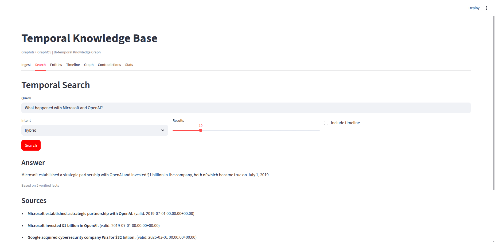
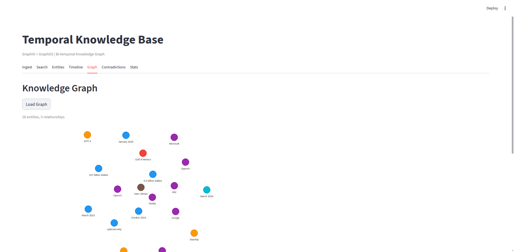
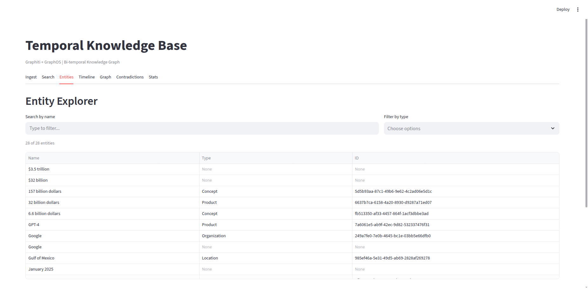
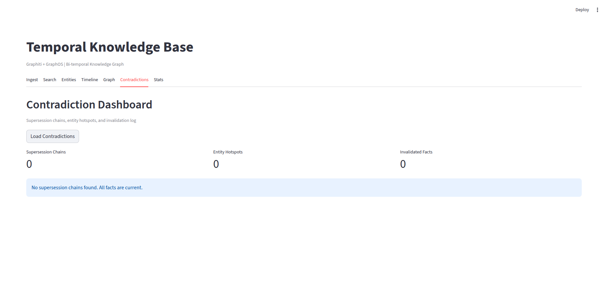

# Temporal Knowledge Base

[](https://github.com/vpakspace/temporal-knowledge-base/actions/workflows/ci.yml)

Bi-temporal knowledge graph framework built on [Graphiti](https://github.com/getzep/graphiti) (Zep AI) with a 16-layer architecture inspired by [GraphOS](https://arxiv.org/abs/2502.02767) — a reference design for knowledge graph operating systems that separates ingestion, storage, retrieval, and generation into composable layers. Ingest text, documents, and structured data into a Neo4j-backed temporal graph with automatic entity resolution, fact invalidation, and hybrid search.

## Quick Start

```bash
git clone https://github.com/vpakspace/temporal-knowledge-base.git
cd temporal-knowledge-base
python -m venv .venv && source .venv/bin/activate
pip install -r requirements.txt
docker compose up -d              # Start Neo4j
echo 'OPENAI_API_KEY=sk-...' > .env
./run_api.sh                      # http://localhost:8000
./run_streamlit.sh                # http://localhost:8501 (in another terminal)
```

## Key Features

- **Bi-temporal model** — every fact tracks both *valid time* (when true in reality) and *transaction time* (when the system learned it), with automatic invalidation chains (`SUPERSEDED_BY`)
- **Dual-track storage** — entity layer (structural graph) + temporal event layer (atomic facts with bi-temporal metadata)
- **Hybrid search** — combines vector similarity (OpenAI embeddings) with structural graph traversal, temporal filtering, and RRF/MMR fusion
- **Document processing** — IBM Docling extracts tables, images, and text from PDF, DOCX, PPTX, XLSX, HTML with TableFormer and OCR
- **Table-aware chunking** — markdown tables are treated as atomic units and never split across chunks
- **Auto temporal hints** — natural language questions like "What was OpenAI's valuation in 2023?" automatically extract temporal filters
- **Contradiction dashboard** — visualize supersession chains, entity hotspots (most contradicted), and invalidation log
- **Community detection** — Graphiti label propagation + LLM summarization, with lightweight BFS cluster fallback
- **Graph visualization** — interactive knowledge graph rendered with `streamlit-agraph`, color-coded by entity type
- **Export / Import** — full graph dump to JSON and idempotent restore (MERGE by ID)
- **Batch ingestion** — ingest multiple episodes in one request with per-episode error reporting
- **Webhook notifications** — HTTP POST to registered URLs when facts are superseded
- **Caching layer** — in-memory TTL cache for LLM intent classification and embedding generation (saves OpenAI API calls)
- **Metrics & monitoring** — per-endpoint latency (p50/p95), request/error counts, pipeline throughput, uptime
- **API authentication** — optional `X-API-Key` header for all `/api/*` endpoints
- **Three interfaces** — REST API (FastAPI), Web UI (Streamlit 7 tabs), and MCP server (Claude Code integration)

## Screenshots

| Search with temporal hints | Knowledge graph visualization |
|:-:|:-:|
|  |  |

| Entity explorer | Contradiction dashboard |
|:-:|:-:|
|  |  |

## Architecture

```
┌─────────────────────────────────────────────────────────────────┐
│  Layers 1-4    API & UI Layer                                   │
│                FastAPI (REST) + Streamlit (7 tabs)               │
│                Intent Classification, Query Decomposition        │
├─────────────────────────────────────────────────────────────────┤
│  Layer 5       Ingestion Pipeline                               │
│                load → chunk → extract → resolve → write          │
├─────────────────────────────────────────────────────────────────┤
│  Layers 6-7    Storage Layer                                    │
│                Neo4j (bi-temporal) + Vector Store (embeddings)   │
│                └─ Graphiti Core (add_episode, search)            │
├─────────────────────────────────────────────────────────────────┤
│  Layers 8-11   Query Engine                                     │
│                Hybrid Search: RRF/MMR + Temporal Filtering       │
├─────────────────────────────────────────────────────────────────┤
│  Layers 12-16  Response & Verification                          │
│                Response Builder + Temporal Verifier (Layer 14)   │
│                Contradiction Detection, Fact Validation          │
└─────────────────────────────────────────────────────────────────┘
```

## Project Structure

```
temporal-knowledge-base/
├── core/                    # Config, models (13 Pydantic), exceptions, TTL cache, metrics, webhooks
├── storage/                 # Neo4j async client (bi-temporal CRUD), vector store
├── graphiti_adapter/        # Graphiti client wrapper, search recipes (RRF/MMR)
├── ingestion/               # Pipeline (5 stages), semantic chunker, DoclingLoader
├── temporal/                # Invalidation agent (3 filters + LLM), entity resolution
├── retrieval/               # Query engine (intent-aware search with fallback)
├── generation/              # LLM client (with cache), temporal verifier, response builder
├── api/                     # FastAPI server (22 endpoints), auth middleware, metrics middleware
├── ui/                      # Streamlit UI (7 tabs)
├── tests/                   # 117 unit + 30 integration = 147 tests
├── mcp_server.py            # MCP server (6 tools for Claude Code)
├── mcp_launcher.py          # Lightweight MCP proxy (instant startup)
├── Dockerfile               # Multi-stage Python build
├── docker-compose.yml       # Neo4j 5-community + optional API/UI services
├── run_api.sh               # Start FastAPI
├── run_streamlit.sh         # Start Streamlit
└── requirements.txt
```

## Prerequisites

- **Python 3.11+** (tested on 3.12)
- **Docker** and **Docker Compose** (for Neo4j)
- **OpenAI API key** (for embeddings and LLM extraction)

## Installation

### 1. Clone the repository

```bash
git clone https://github.com/vpakspace/temporal-knowledge-base.git
cd temporal-knowledge-base
```

### 2. Create a virtual environment

```bash
python -m venv .venv
source .venv/bin/activate
```

### 3. Install dependencies

```bash
pip install -r requirements.txt
```

> **Note on Docling**: The `docling` package downloads ML models (~1-2 GB) to `~/.cache/huggingface/` on first use. This happens automatically when you first process a PDF/DOCX/PPTX/XLSX/HTML file.

### 4. Start Neo4j

```bash
docker compose up -d
```

This starts a Neo4j 5 Community container with APOC plugin:
- **Browser**: http://localhost:7474
- **Bolt**: bolt://localhost:7687
- **Credentials**: `neo4j` / `temporal_kb_2026`

Wait for Neo4j to become healthy:

```bash
docker compose ps   # STATUS should show "healthy"
```

### 5. Configure environment

Create a `.env` file in the project root:

```bash
cat > .env << 'EOF'
# Required
OPENAI_API_KEY=sk-your-openai-api-key

# Optional (defaults shown)
NEO4J_URI=bolt://localhost:7687
NEO4J_USER=neo4j
NEO4J_PASSWORD=temporal_kb_2026
OPENAI_EMBEDDING_MODEL=text-embedding-3-small
OPENAI_LLM_MODEL=gpt-4o-mini

# API authentication (empty = auth disabled)
# Generate your own secret: python3 -c "import secrets; print(secrets.token_hex(32))"
APP_API_KEY=
EOF
```

### 6. Verify installation

```bash
# Run unit tests (no external dependencies required)
pytest tests/ -m "not integration" -q

# Run integration tests (requires Neo4j + OpenAI API key)
pytest tests/ -m integration -q
```

## Usage

### Start the API server

```bash
./run_api.sh
# or
uvicorn api.server:app --host 0.0.0.0 --port 8000 --reload
```

API available at http://localhost:8000. Interactive docs at http://localhost:8000/docs.

### Start the Web UI

In a separate terminal:

```bash
./run_streamlit.sh
# or
streamlit run ui/streamlit_app.py --server.port 8501
```

UI available at http://localhost:8501 with seven tabs:

| Tab | Description |
|-----|-------------|
| **Ingest** | Paste text, batch JSON, or upload files (TXT, MD, JSON, PDF, DOCX, PPTX, XLSX, HTML) |
| **Search** | Ask questions with automatic temporal hint extraction and LLM answers |
| **Entities** | Entity explorer with type filter, name search, drill-down to relationships and events |
| **Timeline** | Entity timelines (autocomplete dropdown) and fact evolution chains |
| **Graph** | Interactive knowledge graph visualization (color-coded by entity type, communities) |
| **Contradictions** | Supersession chains, entity hotspots (most contradicted), invalidation log |
| **Stats** | Graph statistics, cache stats, API metrics, export/import, webhook management |

## API Endpoints

### Ingestion

| Method | Path | Description |
|--------|------|-------------|
| `POST` | `/api/ingest` | Ingest a text episode into the knowledge graph |
| `POST` | `/api/ingest/file` | Upload and ingest a document via Docling |
| `POST` | `/api/ingest/batch` | Batch ingest (JSON array), per-episode error reporting |

### Search & Query

| Method | Path | Description |
|--------|------|-------------|
| `POST` | `/api/search` | Temporal-aware hybrid search |
| `POST` | `/api/ask` | Ask a question — search + LLM-generated answer |
| `GET` | `/api/timeline/{entity_id}` | Get the timeline of an entity |
| `GET` | `/api/evolution/{event_id}` | Get the SUPERSEDED_BY chain of a fact |

### Entity & Graph

| Method | Path | Description |
|--------|------|-------------|
| `GET` | `/api/entities` | List all entities (for autocomplete) |
| `GET` | `/api/entities/{entity_id}` | Entity details with relationships and event counts |
| `GET` | `/api/graph` | Nodes + edges for visualization |
| `GET` | `/api/communities` | Community nodes or lightweight BFS clusters |
| `POST` | `/api/communities/build` | Build communities via Graphiti (LLM summarization) |
| `GET` | `/api/contradictions` | Supersession chains, hotspots, invalidation log |

### Data Management

| Method | Path | Description |
|--------|------|-------------|
| `GET` | `/api/export` | Export full graph data as JSON |
| `POST` | `/api/import` | Import graph data from JSON export (MERGE by ID) |
| `GET` | `/api/webhooks` | List registered webhooks |
| `POST` | `/api/webhooks` | Register webhook URL for supersession events |
| `DELETE` | `/api/webhooks?url=` | Remove a webhook |

### Monitoring & System

| Method | Path | Description |
|--------|------|-------------|
| `GET` | `/api/metrics` | Request/pipeline metrics (counters, latencies, uptime) |
| `GET` | `/api/cache/stats` | Cache hit/miss statistics (LLM + embeddings) |
| `POST` | `/api/cache/clear` | Clear all caches |
| `GET` | `/api/stats` | Graph statistics |
| `GET` | `/health` | Health check |

### Example: Ingest an episode

```bash
curl -X POST http://localhost:8000/api/ingest \
  -H "Content-Type: application/json" \
  -d '{
    "content": "OpenAI raised $6.6B at a $157B valuation in October 2024.",
    "source": "tech-news",
    "episode_type": "text"
  }'
```

### Example: Ask a question

```bash
curl -X POST http://localhost:8000/api/ask \
  -H "Content-Type: application/json" \
  -d '{
    "question": "What was OpenAI valuation in 2024?"
  }'
```

The temporal hint ("2024") is automatically extracted and used as a `point_in_time` filter.

### Example: Upload a document

```bash
curl -X POST http://localhost:8000/api/ingest/file \
  -F "file=@report.pdf" \
  -F "source=quarterly-report"
```

Supports PDF, DOCX, PPTX, XLSX, and HTML via IBM Docling.

### Example: Batch ingest

```bash
curl -X POST http://localhost:8000/api/ingest/batch \
  -H "Content-Type: application/json" \
  -d '[
    {"content": "Fact one.", "source": "batch"},
    {"content": "Fact two.", "source": "batch"}
  ]'
```

### Example: With API authentication

```bash
curl -X POST http://localhost:8000/api/ask \
  -H "Content-Type: application/json" \
  -H "X-API-Key: your-secret-key" \
  -d '{"question": "Who invested in OpenAI?"}'
```

## MCP Server (Claude Code Integration)

The project includes an MCP server providing 6 tools for direct use from Claude Code.

### Tools

| Tool | Description |
|------|-------------|
| `tkb_ingest` | Add an episode to the knowledge graph (text or file) |
| `tkb_search` | Temporal-aware fact search |
| `tkb_ask` | Ask a question — search + LLM answer with auto temporal hints |
| `tkb_timeline` | Get the timeline of an entity |
| `tkb_evolution` | Get the SUPERSEDED_BY chain |
| `tkb_stats` | Graph statistics |

### Setup

Add to `~/.claude.json`:

```json
{
  "mcpServers": {
    "temporal-kb": {
      "command": "python3",
      "args": ["mcp_launcher.py"],
      "cwd": "/path/to/temporal-knowledge-base",
      "env": {
        "OPENAI_API_KEY": "sk-your-openai-api-key",
        "NEO4J_URI": "bolt://localhost:7687",
        "NEO4J_USER": "neo4j",
        "NEO4J_PASSWORD": "temporal_kb_2026"
      }
    }
  }
}
```

> **Why `mcp_launcher.py`?** The launcher is a lightweight proxy (~0.02s startup) that responds to health checks instantly and lazy-loads the real FastMCP server in the background. This prevents Claude Code timeouts caused by heavy imports (Graphiti, OpenAI, Neo4j).

## Bi-Temporal Model

Every fact in the knowledge graph has three temporal dimensions:

| Dimension | Field | Description |
|-----------|-------|-------------|
| **Valid Time** | `valid_at` | When the fact is true in reality |
| **Transaction Time** | `created_at` | When the system learned about the fact |
| **Invalidation** | `invalid_at` | When the fact was superseded by a newer one |

### Invalidation Agent

When a new fact contradicts an existing one, the invalidation agent applies three filters plus LLM confirmation:

1. **Temporal overlap** — do the time periods overlap?
2. **Shared entities** — do they mention the same entities?
3. **Semantic similarity** > 0.5 — cosine similarity of embeddings
4. **LLM confirmation** — final check via LLM

Old facts are linked to their replacements via `SUPERSEDED_BY` edges, creating evolution chains. When supersession occurs, registered webhooks receive HTTP POST notifications.

## Document Processing (Docling)

IBM Docling provides AI-powered document understanding:

| Format | Features |
|--------|----------|
| PDF | TableFormer (table structure recognition), OCR, image classification |
| DOCX | Full text + table extraction |
| PPTX | Slide text + tables |
| XLSX | Spreadsheet → markdown tables |
| HTML | Structured content extraction |
| TXT, MD | Direct read (no Docling needed) |

### Programmatic usage

```python
from ingestion.document_loader import DoclingLoader

loader = DoclingLoader()

# From file path
result = loader.load("report.pdf")
print(result.markdown)   # Full markdown with tables
print(result.tables)     # [{"caption": ..., "markdown": ..., "csv": ..., "page": ...}]
print(result.images)     # [{"caption": ..., "page": ...}]
print(result.metadata)   # {"format": ".pdf", "pages": 12, "tables_count": 3, "images_count": 2}

# From bytes (file upload)
result = loader.load_bytes(raw_bytes, "report.pdf")
```

## Caching

LLM intent classification and embedding generation are cached in-memory to reduce OpenAI API calls:

| Cache | TTL | Max Size | What's cached |
|-------|-----|----------|---------------|
| **LLM** | 10 min | 500 entries | `classify_intent` results (same query → same intent) |
| **Embeddings** | 1 hour | 2000 entries | `embed_text` results (same text → same vector) |

Monitor cache performance via `GET /api/cache/stats` or the Stats tab in the UI.

## Monitoring

The API tracks metrics in-process (no external dependencies):

- **Per-endpoint latency** — min, max, avg, p50, p95
- **Request/error counts** — total requests, HTTP errors by status code
- **Pipeline metrics** — ingestion count, entities/events extracted, invalidations
- **Search metrics** — query count, results returned, search duration
- **Uptime** — time since API start

View metrics via `GET /api/metrics` or the Stats tab in the UI. Metrics reset on API restart.

## Testing

```bash
# Unit tests only (no external dependencies)
pytest tests/ -m "not integration" -q

# Integration tests (requires running Neo4j + OpenAI API key)
pytest tests/ -m integration -q

# All tests
pytest tests/ -q

# With coverage
pytest tests/ -m "not integration" --cov=. --cov-report=term-missing
```

### Test breakdown

| File | Tests | What it covers |
|------|-------|----------------|
| `test_auth.py` | 27 | API key authentication (enabled/disabled, all endpoints protected) |
| `test_document_loader.py` | 25 | DoclingLoader, DocumentResult, format support |
| `test_mcp_server.py` | 24 | MCP tool implementations, temporal hint extraction |
| `test_models.py` | 15 | Pydantic models, enums, serialization |
| `test_query_engine.py` | 8 | Query engine, search_with_fallback, intent routing |
| `test_resolution.py` | 7 | Entity resolution |
| `test_chunker.py` | 6 | Semantic chunking, table-aware splitting |
| `test_vector_store.py` | 5 | Vector store operations |
| `test_integration_neo4j.py` | 10 | Neo4j CRUD, supersession chains, point-in-time |
| `test_integration_openai.py` | 11 | Embeddings, LLM generation, intent classification |
| `test_integration_extraction.py` | 5 | Dual-track extraction pipeline |
| `test_integration_pipeline.py` | 4 | End-to-end: ingest → extract → search → respond |

## Configuration Reference

All settings can be configured via environment variables or `.env` file:

| Variable | Default | Description |
|----------|---------|-------------|
| `OPENAI_API_KEY` | *(required)* | OpenAI API key |
| `NEO4J_URI` | `bolt://localhost:7687` | Neo4j connection URI |
| `NEO4J_USER` | `neo4j` | Neo4j username |
| `NEO4J_PASSWORD` | `temporal_kb_2026` | Neo4j password |
| `OPENAI_EMBEDDING_MODEL` | `text-embedding-3-small` | Embedding model |
| `OPENAI_LLM_MODEL` | `gpt-4o-mini` | LLM model for extraction/generation |
| `OPENAI_LLM_TEMPERATURE` | `0.0` | LLM temperature |
| `APP_API_KEY` | *(empty)* | Self-generated secret for API auth. When set, all `/api/*` endpoints require `X-API-Key` header. Empty = open access. Generate: `python3 -c "import secrets; print(secrets.token_hex(32))"` |
| `APP_INVALIDATION_SIMILARITY_THRESHOLD` | `0.5` | Min similarity for invalidation |
| `APP_DEFAULT_SEARCH_LIMIT` | `10` | Default search result limit |

## Tech Stack

- **[Graphiti](https://github.com/getzep/graphiti)** 0.26+ — temporal knowledge graph engine (Zep AI)
- **[Neo4j](https://neo4j.com/)** 5.x — graph database (Community Edition, Docker)
- **[OpenAI](https://platform.openai.com/)** — `gpt-4o-mini` for extraction/generation, `text-embedding-3-small` for embeddings
- **[IBM Docling](https://github.com/DS4SD/docling)** — AI-powered document conversion (PDF, DOCX, PPTX, XLSX, HTML)
- **[FastAPI](https://fastapi.tiangolo.com/)** — async REST API with middleware metrics
- **[Streamlit](https://streamlit.io/)** — web UI (7 tabs)
- **[FastMCP](https://github.com/jlowin/fastmcp)** — MCP server for Claude Code
- **[Pydantic](https://docs.pydantic.dev/) v2** — data models and settings
- **[streamlit-agraph](https://github.com/ChrisDelClea/streamlit-agraph)** — interactive graph visualization
- **[httpx](https://www.python-httpx.org/)** — async HTTP client (webhooks)

## Docker (Full Stack)

Run the entire stack (Neo4j + API + UI) without installing Python dependencies:

```bash
# 1. Create .env file (see "Configure environment" above)

# 2. Start all services
docker compose up -d --build

# 3. Wait for healthy status
docker compose ps
```

Once healthy:
- **API**: http://localhost:8000 (docs at `/docs`)
- **UI**: http://localhost:8501
- **Neo4j Browser**: http://localhost:7474

To run only Neo4j (and install Python locally):

```bash
docker compose up -d neo4j
```

> **WSL2 + Docker Desktop users:** If Neo4j fails with `UnknownHostException`, run it standalone instead:
>
> ```bash
> docker run -d --name temporal-kb-neo4j -p 7474:7474 -p 7687:7687 \
>   -e NEO4J_AUTH=neo4j/temporal_kb_2026 -e "NEO4J_PLUGINS=[\"apoc\"]" \
>   neo4j:5-community
> ```
>
> Then start API and UI locally: `./run_api.sh` and `./run_streamlit.sh`

## License

MIT
